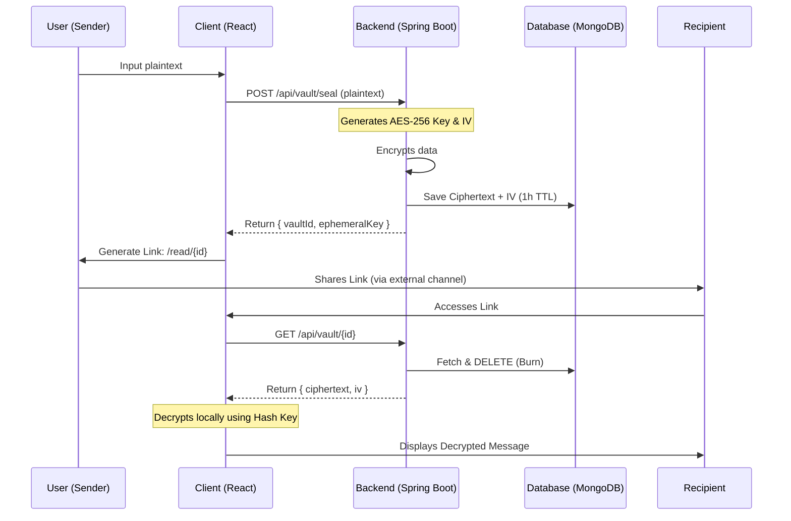

# 🔐 MsgCrypt: Zero-Knowledge Ephemeral Vault

**MsgCrypt** is a "burn-after-reading" messaging platform built with a security-first, zero-knowledge architecture. It ensures that sensitive data is encrypted before storage and that decryption keys never touch the server.

---

## 🚀 Core Philosophy

1.  **Zero-Knowledge**: The server stores only encrypted blobs. The decryption key exists only in the client's browser and the URL's #hash fragment.
2.  **Ephemerality**: Data is volatile. Once a message is read, it is shredded from the database immediately. Unread messages are automatically purged after 1 hour (TTL).
3.  **Modern Security**: Leverages the browser's native **Web Crypto API** for high-performance, client-side cryptographic operations.

---

## 🏗️ Architecture

MsgCrypt splits its logic between a robust Spring Boot backend and a reactive React frontend.

### The "Seal & Burn" Flow



---

## 🛡️ Security Features

| Feature | Implementation | Security Benefit |
| :--- | :--- | :--- |
| **Client-Side Decryption** | Web Crypto API (`AES-GCM`) | Decryption happens in the browser; plaintext is never exposed to the network. |
| **Zero-Knowledge Keys** | URL Hash Fragment (`#key=...`) | Browsers do not send the hash fragment to the server in HTTP requests. |
| **Data Shredding** | "Burn-on-Read" Logic | Eliminates the possibility of data being recovered once accessed. |
| **Auto-Expiration** | MongoDB TTL Index (1 Hour) | Minimizes the attack surface for unread messages. |
| **AES-256-GCM** | Authenticated Encryption | Ensures both confidentiality and integrity of the payload. |

---

## 🛠️ Tech Stack

- **Backend**: Java 21, Spring Boot 4.0 (LTS), Spring Data MongoDB.
- **Frontend**: React.js, Tailwind CSS v4, Vite, Lucide Icons.
- **Database**: MongoDB (Atlas or Local).
- **Security**: SubtleCrypto (Web Crypto API).

---

## ⚙️ Installation & Setup

### Prerequisites
- **Java 21** (Managed via SDKMAN): `sdk install java 21.0.10-tem`
- **Node.js** (v18+)
- **MongoDB** (running on `localhost:27017`)

### Backend
```bash
./mvnw spring-boot:run
```

### Frontend
```bash
cd frontend
npm install
npm run dev -- --port 3000
```

---

## 📜 License
MIT License. Feel free to use and modify for your own secure applications.
